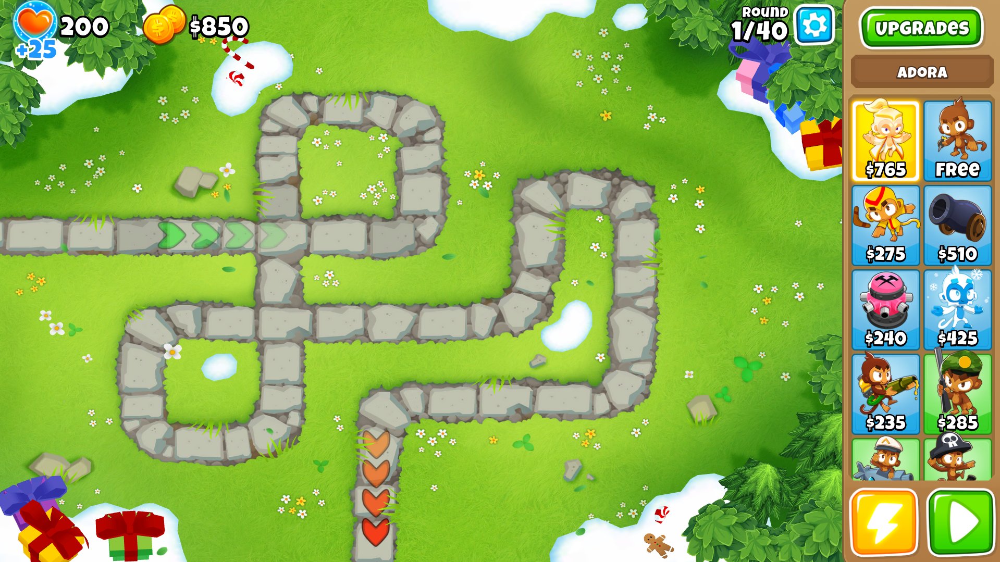

# BTD6Auto

This program will automate getting Insta Monkeys or XP on Monkey Meadow Easy

## Requirements

* Python3 64bit
  * Download at: <https://www.python.org/downloads/release/python-381/>
* 1920x1080 resolution
* In-game fullscreen
* Program specfic dependencies (Run through command line)
  * Windows:

  ```bat
  install.bat
  ```

  * Linux:

  ```bash
  ./install.sh
  ```

* For this automation, you must have the following Monkey Knowledge
  * More Cash
  * Preferably the entire Heroes Knowledge tree
    * If not the entire tree, make sure to have Hero Favors
* This Monkey Knowledge isn't required, but may be nice to have
  * Hard Tack
  * Hot Magic
  * Flat Pack Buildings
* You must have the game open
* You must have Adora
* Easy and Standard Monkey Meadow must be selected
* You must be in the map itself


## Running the Program

Open up a command line terminal

* Restart after MOAB:

    ```bat
    cd path/to/BTD6Auto/"Monkey Meadow"
    python mmes.py x
    ```

* Restart after BAD:

    ```bat
    cd path/to/BTD6Auto/"Monkey Meadow"
    python mmes.py i
    ```

### IMPORTANT

*DO NOT CHANGE ACTIVE WINDOW OR MESS WITH THE GAME AT ALL.*
*THE PROGRAM WILL FAIL TO EXECUTE PROPERLY IF YOU DO*

*THE PROGRAM WILL TAKE CONTROL OF YOUR MOUSE FOR MOST OF THE RUNTIME*
*YOU WILL HAVE THREE SECONDS AFTER THE RESTART BUTTON HAS BEEN CLICKED TO CLOSE THE PROGRAM*

## Notes

Due to how Ninja Kiwi only allows left clicks to clear the level up screen, I tried to implement some feature that would clear that screen and resume the program.

Unsure if it works correctly. It may lead to a program failure.
